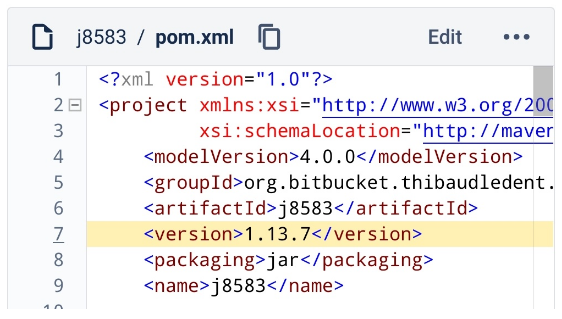

# j8583

j8583 is a Java implementation of the ISO8583 protocol.

This repository is a **fork** of [https://bitbucket.org/chochos/j8583](https://bitbucket.org/chochos/j8583).

## How to release

To release a new version of the library to Maven Central:

1. Increment the version of the library in the main `pom.xml` (e.g. set it to `1.13.8`) and create a Pull Request:

   

2.  Merge the Pull Request to the master branch

3.  Run the custom pipeline for the release (go to [branches](https://bitbucket.org/thibaudledent/j8583/branches/) and run the dedicated pipeline):

   

4.  Once the pipeline is green, your new version will appear in [repo1.maven.org/.../j8583/](https://repo1.maven.org/maven2/org/bitbucket/thibaudledent/j8583/j8583/) (and a bit later in: [search.maven.org/artifact/.../j8583](https://search.maven.org/artifact/org.bitbucket.thibaudledent.j8583/j8583))

## Other reference

* Creating a Bitbucket pipeline to automate a Maven release: see this [link](https://thibaudledent.github.io/2019/03/01/bitbucket-pipeline/)