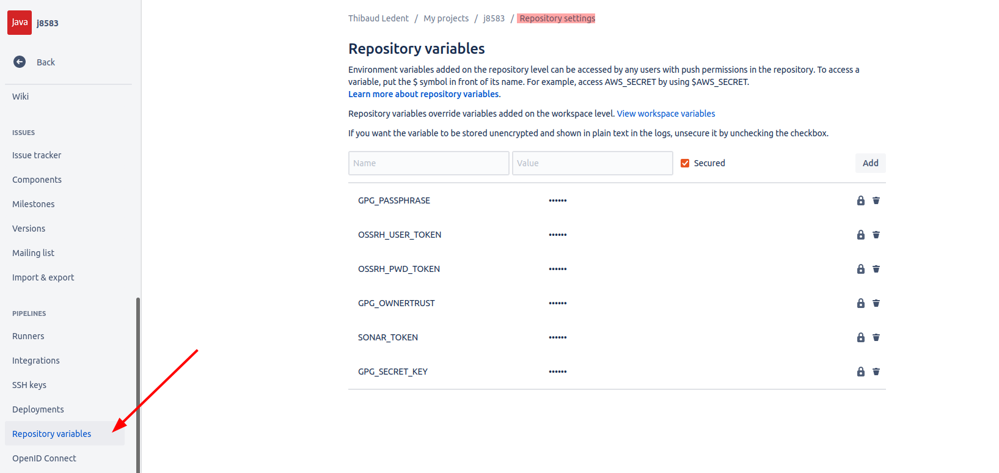

# j8583

j8583 is a Java implementation of the ISO8583 protocol.

This repository is a **fork** of [https://bitbucket.org/chochos/j8583](https://bitbucket.org/chochos/j8583).

## How to release

To release a new version of the library to Maven Central:

1) Increment the version of the library in the main `pom.xml` (e.g. set it to `1.13.8`) and create a Pull Request:

   

2) Merge the Pull Request to the master branch

3) Run the custom pipeline for the release (go to [branches](https://github.com/thibaudledent/j8583/branches) and run the dedicated pipeline):

   

4) Once the pipeline is green, your new version will appear in [repo1.maven.org/.../j8583/](https://repo1.maven.org/maven2/com/github/thibaudledent/j8583/j8583/) (and a bit later in: [search.maven.org/artifact/.../j8583](https://search.maven.org/artifact/com.github.thibaudledent.j8583/j8583))

### Repository Variable

https://bitbucket.org/thibaudledent/j8583/admin/addon/admin/pipelines/repository-variables



* `GPG_PASSPHRASE`: passphrase of the secret gpg key
* `OSSRH_USER_TOKEN`: the `XXX` part of `<username>XXX</username>` from https://oss.sonatype.org/#profile;User%20Token
* `OSSRH_PWD_TOKEN`:  the `XXX` part of `<password>XXX</password>` from https://oss.sonatype.org/#profile;User%20Token
* `GPG_OWNERTRUST`: `gpg --export-ownertrust | base64 | tr -d '\n'`
* `GPG_SECRET_KEY`: `gpg -a --export-secret-keys thibaudledent@gmail.com | base64 | tr -d '\n'`

### Distribute the key

List of available servers: https://www.duinsoft.nl/keyservers.php.

To distribute the key `gpg --keyserver pgp.surfnet.nl --send-keys DB85FB2159287141`

Then it should be available here: https://pgp.surfnet.nl/pks/lookup?search=0xDB85FB2159287141&fingerprint=on&op=index

### Key expiration

The `mvn deploy` might fail on:

```
gpg: signing failed: No secret key
gpg: no default secret key: No secret key
```

It is possible that the reason for this error is simply that the gpg key has expired.

### More info

Article *"Creating a Bitbucket pipeline to automate a Maven release"*, see this [link](https://thibaudledent.github.io/2019/03/01/bitbucket-pipeline/).